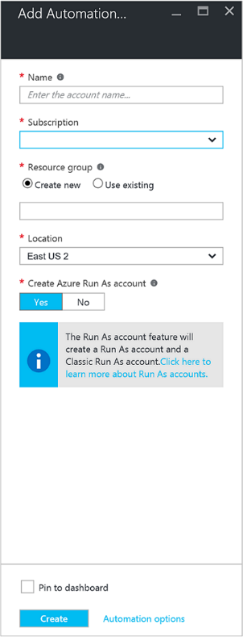
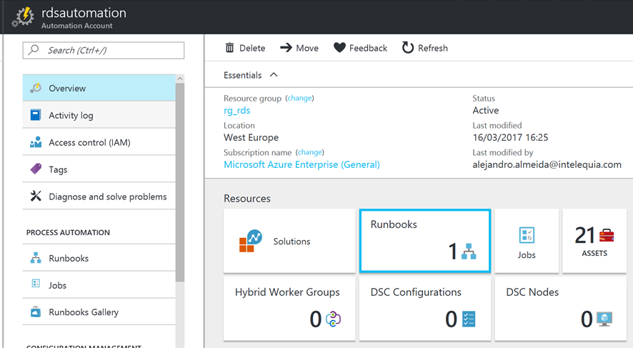

# Deployment
## Admin Guide
---
* [Introduction](./README.md)
* [Architecture](./ArchitectureDiagram.md)
* Deployment
    * [Requirements](./Requirements.md)
    * [Basic deployment](./Deployment-basic.md)
    * [High Availability deployment](./Deployment-HA.md)
    * [Storage Spaces Direct (S2D) Scale-Out File Server (SOFS) Cluster](./S2DFileServer.md)
    * [User Access Web Certificate](./UserAccessWebCert.md)
    * **[AzureAutomation](./AzureAutomation.md)** <--
* [Admin Guide](./RemoteDesktopRemoteApp.md)
---
### Azure Automation
Microsoft Azure Automation provides a way for users to automate the manual tasks that are performed in a cloud environment.

#### Create Automation Account
1. Click New > Add Automation Account
2. Fill the gaps and select suitable options for your environment  


In order to authenticate runbooks which admin ARM resources, we need a Run As Account.   
When you create an Automation account in the Azure portal, you automatically create two authentication entities:
- **A Run As account**: This account creates a service principal in Azure Active Directory (Azure AD) and a certificate. It also assigns the Contributor role-based access control (RBAC), which manages Resource Manager resources by using runbooks.
- **A Classic Run As account**: This account uploads a management certificate, which is used to manage classic resources by using runbooks.

If you see the following warning in the Add Automation Account blade, this is because your account is not a member of the Subscription Admins role and co-admin of the subscription. 


#### Runbooks
A runbook is a set of tasks that perform some automated process in Azure Automation.  

1. YourAutomationAccount >  

2. Runbooks > Browse Gallery  


[Gisela Torres](https://www.returngis.net/en/about-me/) created a parallel shutdown/Start ARM VM's by Resource Group runbook.  
In this project we have edited the script to use Run As Account in order to logging, thus we can avoid logging with credentials. It should look like this:

```PowerShell
workflow Shutdown-Start-ARM-VMs-Parallel
{
    Param(
        [Parameter(Mandatory=$true)]
        [String]
        $ResourceGroupName,
        [Parameter(Mandatory=$true)]
        [Boolean]
        $Shutdown
    )

    $connectionName = "AzureRunAsConnection"    
    	
    # Get the connection "AzureRunAsConnection"
    $servicePrincipalConnection=Get-AutomationConnection -Name $connectionName         

    "Logging in to Azure..."
    Add-AzureRmAccount `
    -ServicePrincipal `
    -TenantId $servicePrincipalConnection.TenantId `
    -ApplicationId $servicePrincipalConnection.ApplicationId `
    -CertificateThumbprint $servicePrincipalConnection.CertificateThumbprint 

    $vms = Get-AzureRmVM -ResourceGroupName $ResourceGroupName;
	
    Foreach -Parallel ($vm in $vms){
		
        if($Shutdown){
            Write-Output "Stopping $($vm.Name)";		
            Stop-AzureRmVm -Name $vm.Name -ResourceGroupName $ResourceGroupName -Force;
        }
        else{
            Write-Output "Starting $($vm.Name)";		
            Start-AzureRmVm -Name $vm.Name -ResourceGroupName $ResourceGroupName;
        }
    }
}
```

If you want to know more..
  
[Azure Automation](https://docs.microsoft.com/en-us/azure/automation/)

---
* [Introduction](./README.md)
* [Architecture](./ArchitectureDiagram.md)
* Deployment
    * [Requirements](./Requirements.md)
    * [Basic deployment](./Deployment-basic.md)
    * [High Availability deployment](./Deployment-HA.md)
    * [Storage Spaces Direct (S2D) Scale-Out File Server (SOFS) Cluster](./S2DFileServer.md)
    * [User Access Web Certificate](./UserAccessWebCert.md)
    * **[AzureAutomation](./AzureAutomation.md)** <--
* [Admin Guide](./RemoteDesktopRemoteApp.md)
---
