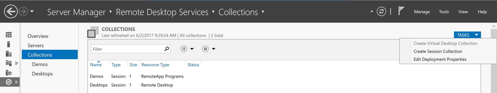

# Create a session collection

In Server Manager, click Remote Desktop Services > Collections > Tasks > Create Session Collection.  

1. Enter a collection Name (for example, ContosoDesktop).  
2. Select an RD Session Host Server (RDSH-VM01), accept the default user groups (Contoso\Domain Users), and enter the Universal Naming Convention (UNC) Path to the user profile disks created above (\RDBE-VM01\UserDisks).
3. Set a Maximum size, and then click Create.

Note that a Session Collection can be two different types. When no Remote Apps are published, the Session Collection is of type "Remote Desktop" which basically means that only full desktop is published. As soon as you have successfully published your first Remote App, the Session Collection is changes to type "Remote App Programs" and the full desktop is no longer published, as a mix in one Session Collection is not supported.
