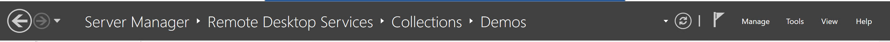
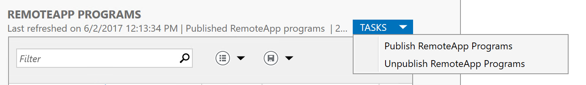

# Publishing your first application

## Remote Desktop

When no Remote Apps are published, the Session Collection is of type "Remote Desktop" which basically means that only full desktop is published. As soon as you have successfully published your first Remote App, the Session Collection is changes to type "Remote App Programs" and the full desktop is no longer published. 

## RemoteApp

You can install a program on the RD Session Host server just like you would install the program on a local desktop. Ensure, however, that you install the program for all users and that all components of the program are installed locally on the RD Session Host server.

In Server Manager, click Remote Desktop Services > Collections > **Your Collection**.
  

Click Task > Publish RemoteApp programs  
  
Follow the wizard selecting suitable programs that will be published. After the wizard is finished, we have the RemoteApps available in RD WebAccess.

if you want to know more..
[Publish RemoteApp programs](https://docs.microsoft.com/en-us/windows-server/remote/remote-desktop-services/rds-create-collection#publish-remoteapp-programs)
[Publishing RemoteApps in Windows Server 2012](https://social.technet.microsoft.com/wiki/contents/articles/10817.publishing-remoteapps-in-windows-server-2012.aspx)
