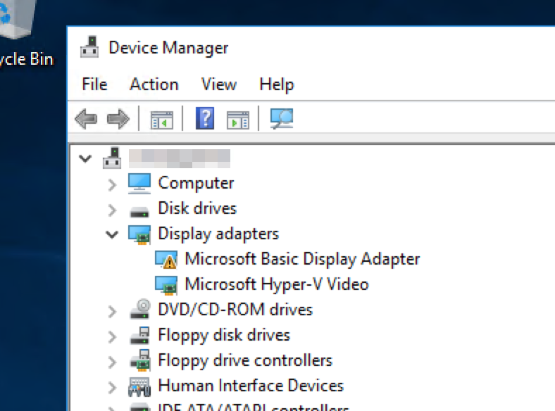
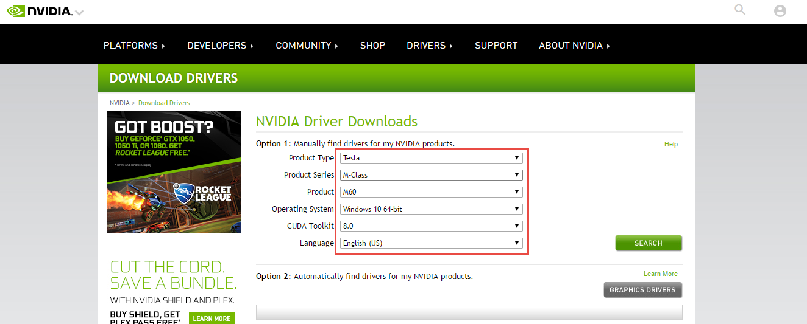
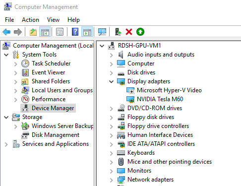
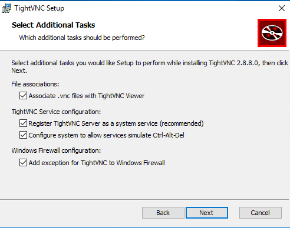
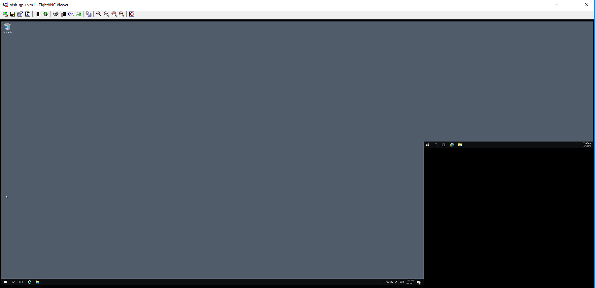
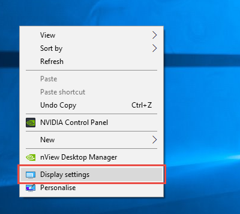
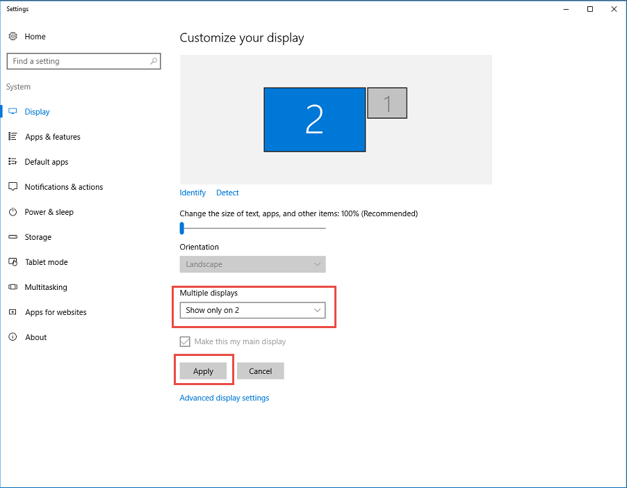

# Admin Guide
---
* [Introduction](/README.md)
* [Architecture](./ArchitectureDiagram.md)
* [Deployment](./Deployment-basic.md)
* Admin Guide
    * [Remote Desktop - RemoteApp](./RemoteDesktopRemoteApp.md)
    * **[RemoteFX](./RemoteFX.md)**<--
    * [Azure AD Proxy](./AzureADProxy.md)
    * [Create Additional Collection](./CreateSessionCollection.md)
    * [Backups adn Restore](./BackupsAndRestore.md)
* [User Guide](./UserAccess.md) 
---

## RemoteFX

Microsoft® RemoteFX™ enables access to the Host de sesión de Escritorio remoto server from a wide range of client devices including rich clients, thin clients, and ultrathin clients. It also ensures lower bandwidth than Windows Server® 2008 R2 when transferring rich graphics applications. When used with a hardware-based application-specific integrated circuit (ASIC), the server running Windows Server 2008 R2 with SP1 is capable of hosting more sessions than previous versions.

### Installation

1. Connect to the Session Host VM.

2. We have to open the **Device Manager**, we'll notice that the driver for M60 video card will be missing.

   

3. Install the lastest [NVIDIA Drivers](http://www.nvidia.com/download/index.aspx).
         
    

4. After rebooting the VM, we have to disable the default display adapter.
    * Expand ‘Display adapters’, right click on ‘Microsoft Hyper-V Video’ and select ‘Disable’. 
    
    

5. Now we have to use only the main display and disable the second one. To configure this option we have to access to the VM using VNC.
    * We recommended [TightVNC](http://www.tightvnc.com/download.php). In the last step in the server installation, it will open the firewall ports. **Remember to open the port in the Network Security Group.**

    

6. After log in using VNC. 
    * We can see both displays.
     
     
    
7. Righ click on Desktop > "Display Settings".

     
8. Select "Show only on 2" in the Multiple display and "Apply".

    
    
    
9. Group Policy settings
   * The following Group Policy settings allow you to configure RemoteFX within your environment:   

| Group Policy setting name | Location | Description | Default value |
| :---  | :---  | :--- | :---  |
| Configure RemoteFX        | Computer Configuration\Administrative Templates\Windows Components\Remote Desktop Services\Remote Desktop Session Host \Remote Session Environment | Enable and disable RemoteFX. | If you do not configure this policy setting, the default behavior will be used. By default, RemoteFX for RD Virtualization Host is enabled and RemoteFX for RD Session Host is disabled. |
| Optimize visual experience when using RemoteFX | Computer Configuration\Administrative Templates\Windows Components\Remote Desktop Services\Remote Desktop Session Host \Remote Session Environment | Specify the visual experience that users will have when connecting to RemoteFX-enabled sessions. | By default, Remote Desktop Connection sessions that use RemoteFX are optimized for a balanced experience over LAN conditions. If you disable or do not configure this policy setting, Remote Desktop Connection sessions that use RemoteFX will be the same as if the medium screen capture rate and the medium image compression settings were selected (the default behavior). |
|Allow RDP redirection of other supported RemoteFX USB devices from this computer | Computer Configuration\Administrative Templates\Windows Components\Remote Desktop Services\Remote Desktop Connection Client\RemoteFX USB Redirection | Permit redirection of supported RemoteFX USB devices. | Not configured |
| Do not allow supported Plug and Play device redirection | Computer Configuration\Administrative Templates\Windows Components\Remote Desktop Services\Remote Desktop Session Host \Device and Resource Redirection | Disable Plug and Play device redirection and RemoteFX USB redirection. | Not configured |

---
* [Introduction](/README.md)
* [Architecture](./ArchitectureDiagram.md)
* [Deployment](./Deployment-basic.md)
* Admin Guide
    * [Remote Desktop - RemoteApp](./RemoteDesktopRemoteApp.md)
    * **[RemoteFX](./RemoteFX.md)**<--
    * [Azure AD Proxy](./AzureADProxy.md)
    * [Create Additional Collection](./CreateSessionCollection.md)
* [User Guide](./UserAccess.md) 
---