# Automated SQL Database scale up/down
Once we have our RDS deployment, we would like to setup SQL Database autoscaling for our Connection Broker, so we can deliver more power during logon storms and then scale down after those peaks. This tutorial allows you to setup automatic SQL Database scale up/down by using Azure Automation. While this is showing how to automate depending on the user workload, you can setup an schedule on the workbook to scale up the SQL Database before the storm occurs.

## SQL Database autoscaling

1.	In this GitHub, go to VirtualLabs > Deploy > Architecture-HA > Scripts and download [Set-AzureSQLDatabaseEdition.ps1](../Deploy/Architecture-HA/Scripts/Set-AzureSqlDatabaseEdition.ps1)

2.	Import this file into Azure.
    1. If you don’t have an Azure Automation Account you can follow this steps to create one: [Azure Automation](./AzureAutomation.md)
    2. Click **your-RDS-Automation-Account** > Runbooks > Add Runbook  
    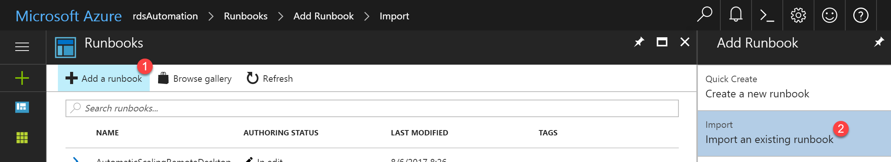  
    3. Click *Import an existing runbook*
    4. It is mandatory to select the Runbook type, we are using “PowerShell Workflow”.  
    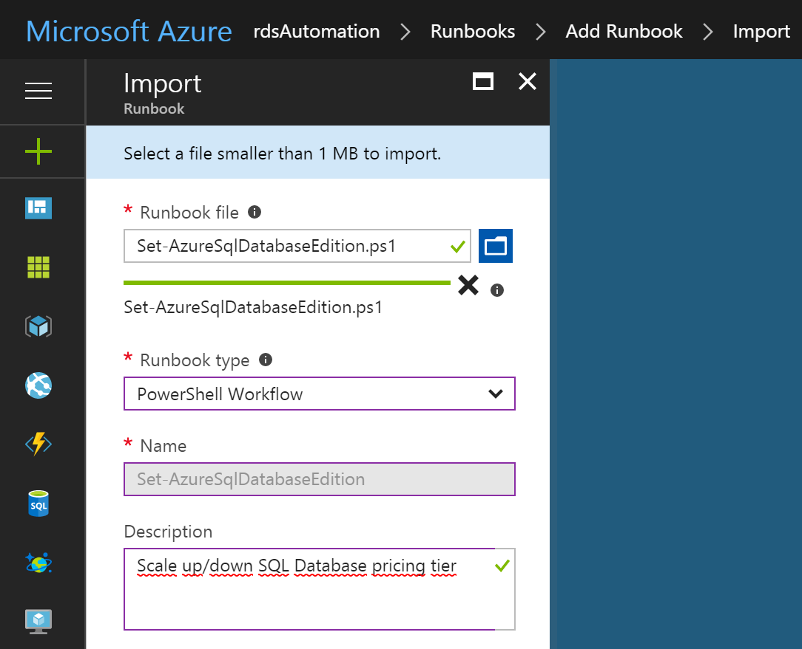  

3.	Automation Account allow us to add credential asset. Let’s add a SQL server credential that we will use in our script.
    1. Click **your-RDS-Automation-Account** > Add a credential  
    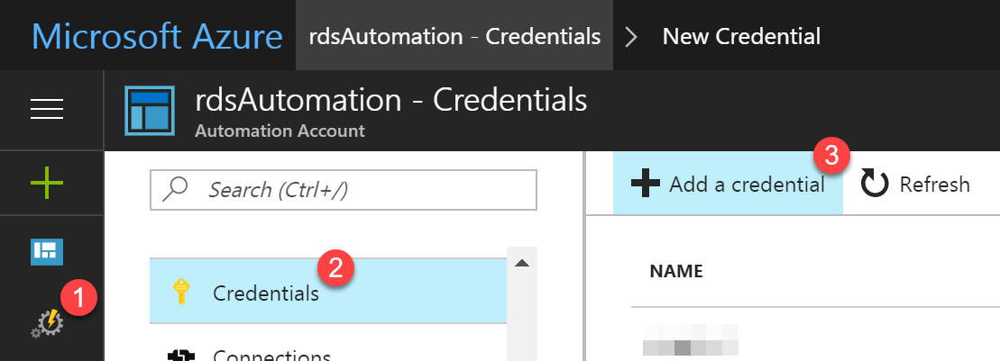
    2. Complete the form and click Create to save the new credential.  
    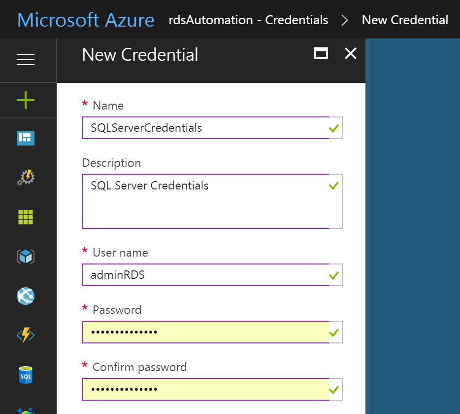

4.	Let’s test our script  
    1. Click *Test Pane*  
    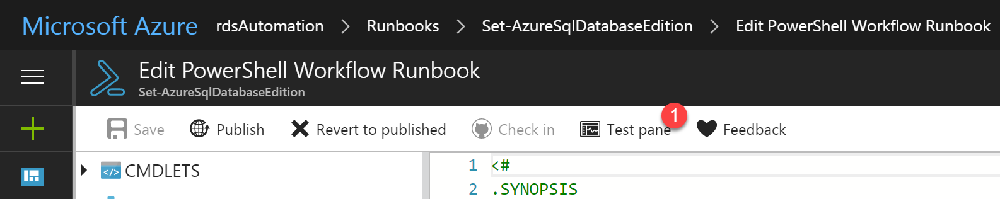  
    This lab templates deploy a standard S0 SQL Database Pricing tier, lets scale it up/down.
    2. Provide the following parameters and click *Start*:
        1. SQL Server name
        2. SQL Database name
        3. The edition tier which we want to scale to, for example Standard
        4. The service level objective, for example S1
        5. Subscription name
        6. SQL server credentials name (added in step 2)
        7. SQL database and SQL Server Resource Group name
        8. Azure Run As Connection Name.  
    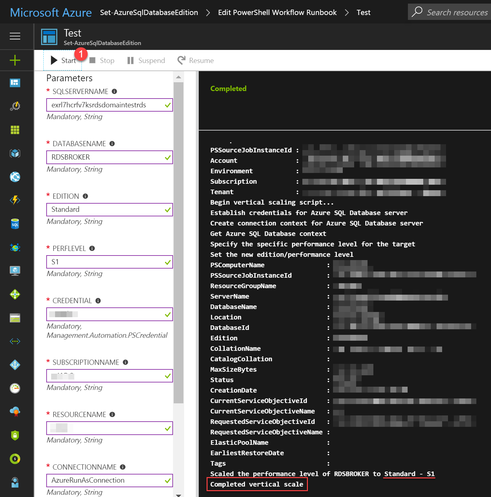  

5.	We may associate a webhook to the Runbook to automate scale up/down:  
    1. Click **your-RDS-Automation-Account** > Runbooks > **your-Runbook** > Webhooks  
    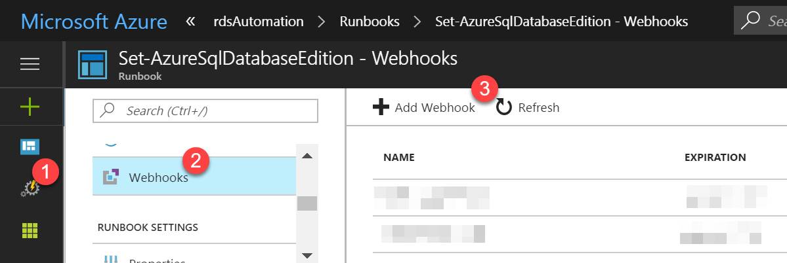
    2. Insert Webhook name, enable it and set an expiration date. Remember to copy the webhook URL, we will use it later.  
    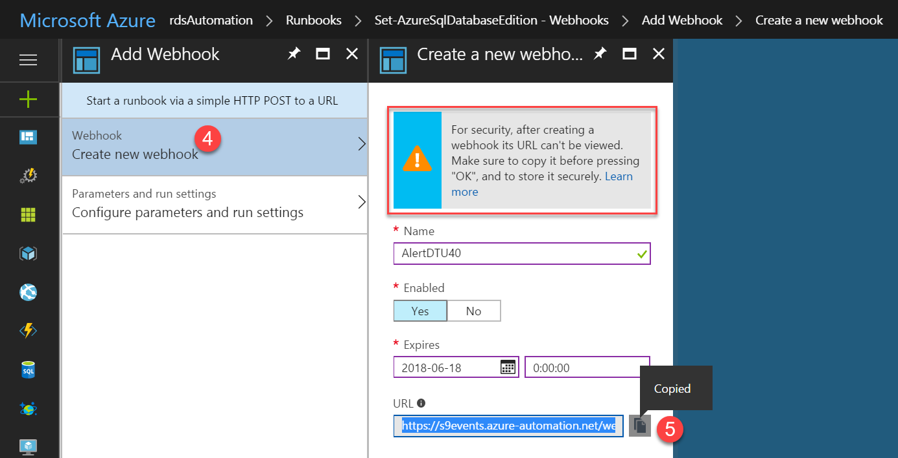
    3. Fill the webhook parameters form  
    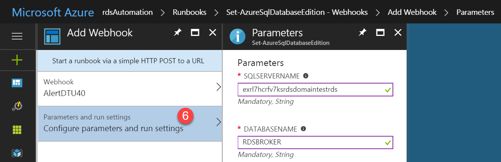  

6.	SQL database DTU percentage alerts might be configured to scale up/down:   
    1. Click SQL databases > **your-database** > Alert Rules > Add Alert  
    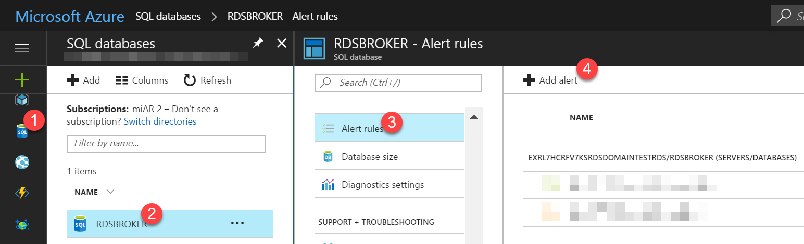  
    2. Fill the SQL database alert form, ensure to paste here the URL to launch the webhook.  
    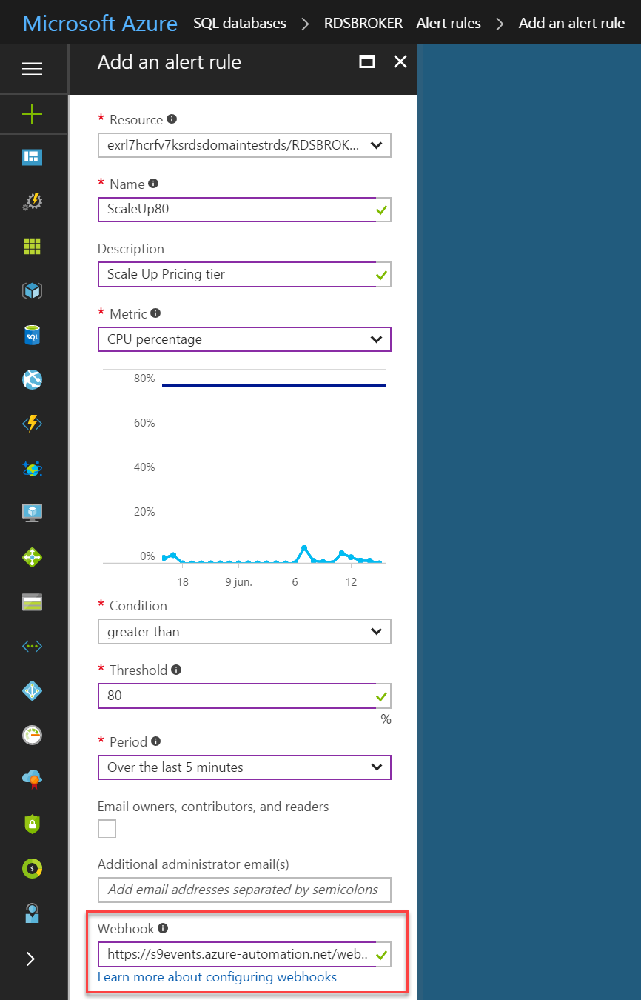  
    If you check *”Email owners, contributors, and readers”* checkbox, this alert will send you an email like below one:  
    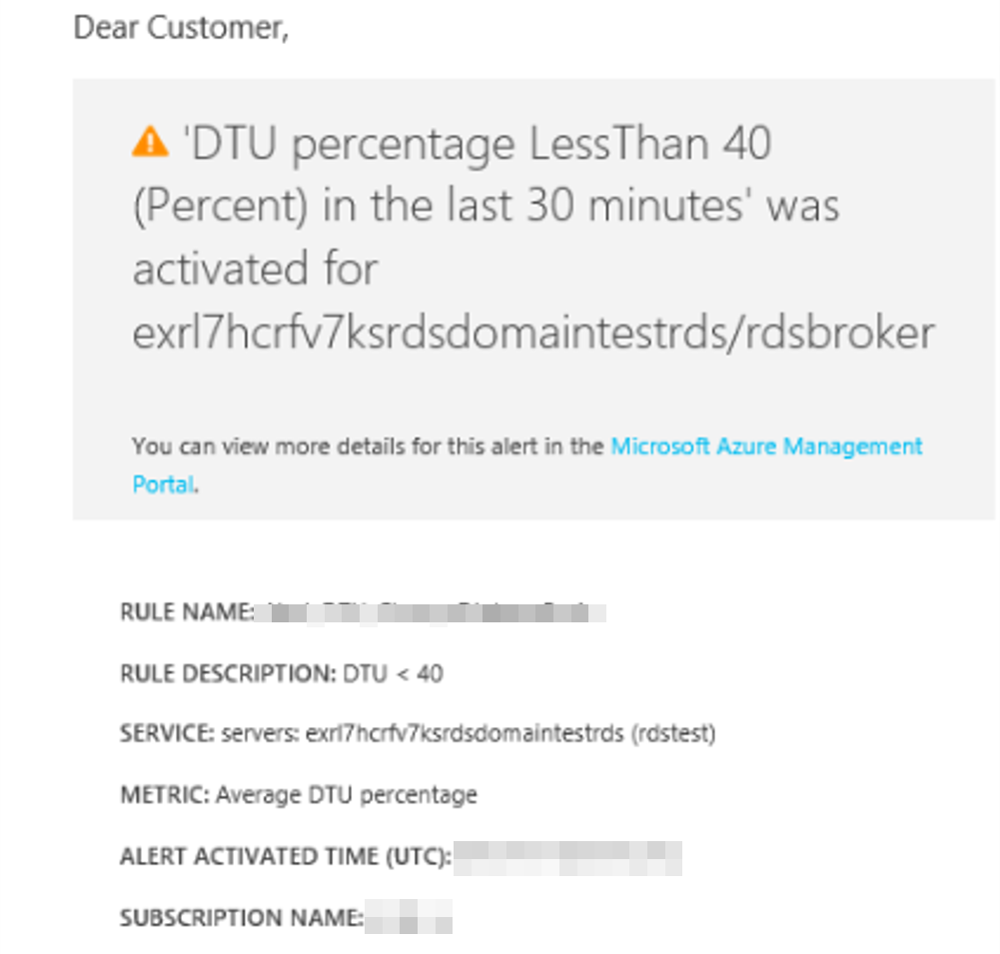

