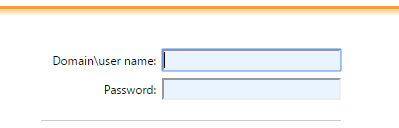
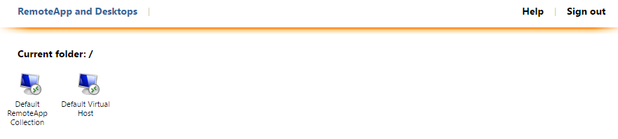

# Web portal
Remote Desktop give us a full desktop experience; while RemoteApp enable us to make programs that are accessed remotely through Remote Desktop Services appear as if they are running on the end user's local computer.

Connect to the deployment through RD Web Access and RD Gateway:  
In Internet Explorer, enter the DNS name for the deployment (like: https://**{your-dns-label-prefix}**.**{location-of-resource-group}**.cloudapp.azure.com/RDWeb).  

Sign in with a domain user account (like **yourdomain**\user). 

  
  
Under RemoteApp and Desktops select one of the collections created for this deployment, (run the .RDP file that has just been download if you are using other browser) and then click Connect.  
 

