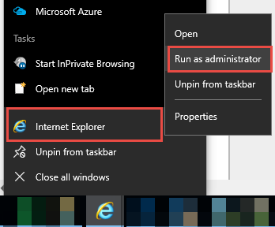
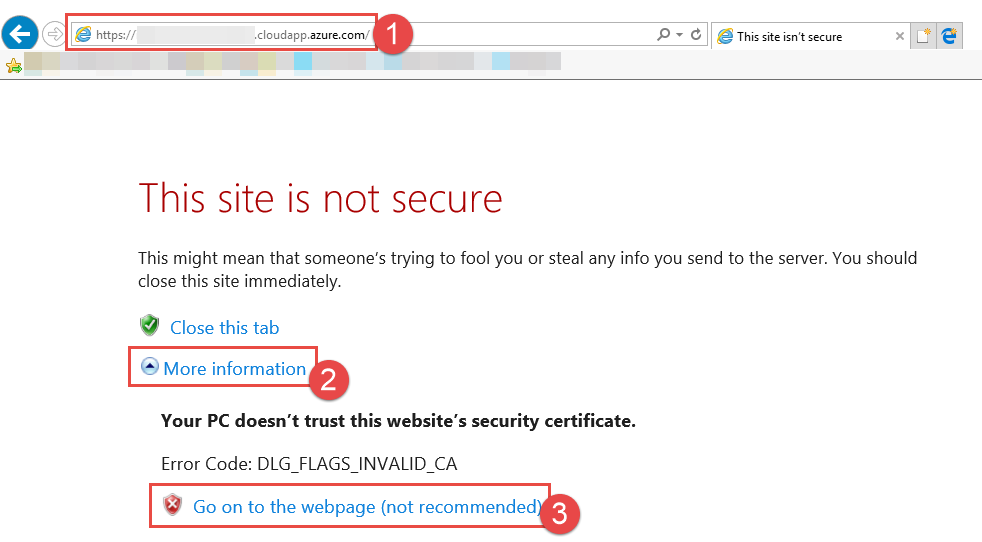
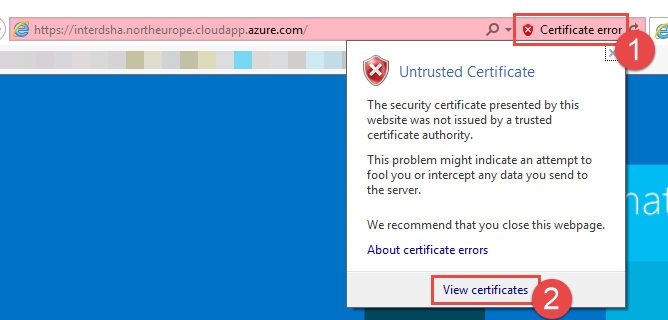
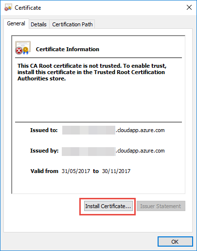
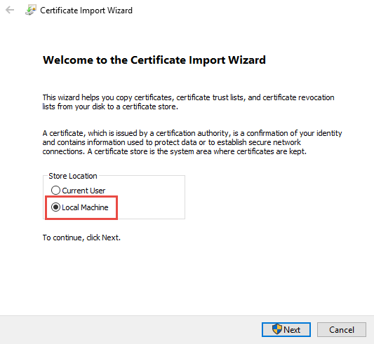
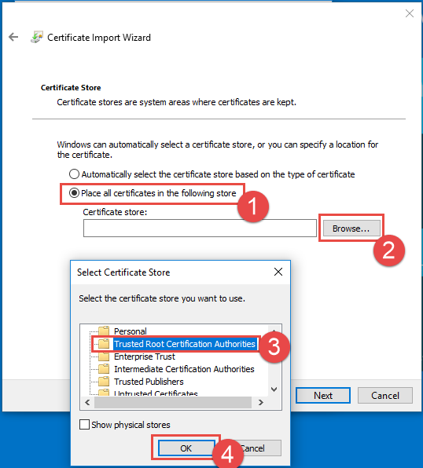

# **Steps for the installation of the certificate for access from the web**
After successful deployment, the URL for the Remote Desktop Gateway (RDGW) and RDWeb site will be on *https://**{your-dns-label-prefix}**.**{location-of-resource-group}**.cloudapp.azure.com/RDWeb*. A self-signed certificate will be used for the deployment. To prevent certificate mismatch issues when connecting using a self-signed certificate, the certificate will need to be installed on the local client machines 'Trusted Root' certificate store. Best practice for a production environment is to configure the deployment to use a trusted certificate.

**To install the self-signed certificate into local machine 'Trusted Root' certificate store:**

1. Run Internet Explorer in administrator mode, browse to URL.
   * *https://**{your-dns-label-prefix}**.**{location-of-resource-group}**.cloudapp.azure.com*
   
   
   
2. In address bar, click on 'Certificate Error' then on 'View Certificates'
   
   
3. Select 'Install Certificate...'

   
4. Store location is 'Local Machine'
   
   
5. Select 'Browse' for 'Place all certificates in the following store'
6. Select 'Trusted Root Certification Authorities'
   
   
7. Now you can logon with the domain credentials in *https://**{your-dns-label-prefix}**.**{location-of-resource-group}**.cloudapp.azure.com/RDWeb*

8. Launch the collection.
